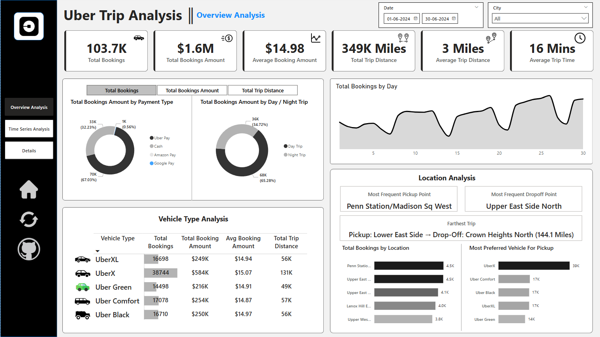

# 🚖 Uber Trip Analysis – Power BI Dashboard  

  

## 📌 Project Overview  
This Power BI dashboard analyzes Uber trip data to uncover **booking trends, revenue insights, and trip efficiency metrics**. It helps stakeholders **optimize pricing, enhance operational efficiency, and improve customer experience** by leveraging interactive visualizations and data analytics.  

## 📂 Dataset & Sources  
- **Source:** [Mention source, e.g., Kaggle, Uber API, Mock Dataset]  
- **Data Size:** [e.g., 50,000+ trip records]  
- **Key Fields:** Booking ID, Trip Distance, Booking Value, Payment Type, Pickup & Drop-off Location, Time of Day  
- **Preprocessing:** Data cleaning, transformations, and relationships were handled in **Power Query & DAX**  

## 📊 Key KPIs & Insights  

### ✅ Dashboard 1: Overview Analysis  
✔ **Total Bookings** – Number of trips over a selected period  
✔ **Total Booking Value** – Total revenue from all trips  
✔ **Average Booking Value** – Revenue per trip  
✔ **Total & Average Trip Distance** – Travel patterns and efficiency  
✔ **Average Trip Time** – Duration analysis  

#### 🔹 Key Features  
🔸 **Measure Selector** – Users can switch between key KPIs dynamically  
🔸 **Filtering by Payment Type & Trip Type** – Analyze revenue by cash, card, or wallet payments  
🔸 **Top 5 Locations by Bookings** – Identify high-demand areas  
🔸 **Most Preferred Vehicle per Location** – Optimize vehicle distribution  
🔸 **Conditional Formatting & Sorting** – Highlighting key trends  

---

### ✅ Dashboard 2: Time Analysis  
✔ **Total Bookings by Time** – Peak demand hours and off-peak trends  
✔ **Bookings by Day Name** – Weekday vs. weekend patterns  
✔ **Heatmap Analysis (Hour vs. Day of the Week)** – Identifies high-demand time slots  

#### 🔹 Key Features  
🔸 **Global Dynamic Measure Selector** – Updates all charts dynamically  
🔸 **10-Minute Interval Trends** – Detects micro-trends in ride demand  
🔸 **Heatmap (Hour vs. Day)** – Pinpoints surge pricing opportunities  

---

### ✅ Dashboard 3: Details Tab  
✔ **Grid Table for Detailed Records** – View granular trip details  
✔ **Drill-Through Functionality** – Right-click on visuals to explore specific data points  
✔ **Data View Bookmark** – Toggle between filtered and full dataset  

#### 🔹 Additional Enhancements  
🔹 **Dynamic Titles** – Charts update based on user selections  
🔹 **Clear Slicer Button** – One-click reset for all filters  
🔹 **Download Raw Data Button** – Export data for further analysis  
🔹 **Conditional Formatting & Tooltips** – Improved user experience  

---

## 🎥 Live Demo & Screenshots  
📹 **[Video Walkthrough](your-video-link-here)** – See the dashboard in action  
📸 **Screenshots** –  
  
  

---

## 🛠 Power BI Implementation Techniques  
🟢 **DAX Measures:** Created dynamic calculations for KPIs  
🟢 **Power Query Transformations:** Cleaned and preprocessed the data  
🟢 **Disconnected Tables & Measure Selector:** Enabled dynamic visual updates  
🟢 **Drill-Through & Bookmarks:** Enhanced data exploration  
🟢 **Heatmaps & Conditional Formatting:** Visualized trends effectively  

---

## 🚀 How to Use the Dashboard  
1️⃣ Download the **[.pbix file](your-file-link-here)** (if available)  
2️⃣ Open it in **Power BI Desktop**  
3️⃣ Explore insights using slicers and interactive visuals  

---

## 💡 Key Learnings & Challenges  
✔ **Optimizing Performance** – Efficiently managing large datasets in Power BI  
✔ **Dynamic Visuals & Interactivity** – Creating an engaging user experience  
✔ **Enhancing Analytical Depth** – Extracting valuable insights for decision-making  

---

## 📬 Let's Connect!  
🔗 **[LinkedIn](your-linkedin-link)**  
🔗 **[Portfolio](your-portfolio-link)**  
🔗 **[GitHub](your-github-profile)**  

---

